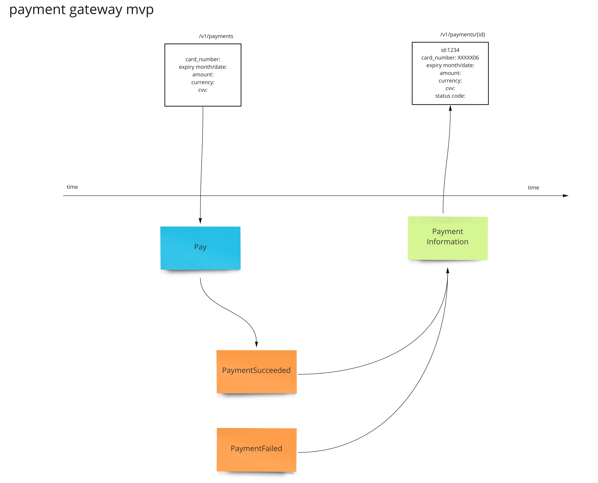

# Event Modeling

## What is event modeling ? 
Please see [eventmodeling.org](https://eventmodeling.org/posts/what-is-event-modeling/) - 15 minutes read

tl;dr ?

> Story telling is something that enables humans to pass knowledge on to subsequent generations and relies heavily on how we store memories - whether logical, visual, auditory or other. This is important because there is a parallel with how information systems were constructed. There is a “memory” of all your visits to the doctor. It’s the ledger of the forms that are filled in with each visit.

and

> aaaaaa

## Why I used that ? 

I decided to write my system using `CQRS/ES` architecture. 
This methodoly naturally fits into this approach.

## What you need to know ?

- Blue card - Command
- Orange card - Event
- Green card - View (ReadModel)

The idea is that any member of the team should 
be able to read out all information from the diagram, 
without any additional commentary (assuming that they have taken part in event modeling). 
Otherwise I failed to model the system:)

## Payment Gateway MVP (Implemented version)

This diagram represent current implemented version.

## Payment Gateway (Proper model)

This diagram represent future shape of this system.

**Assuming** that merchants are fine with eventual consistency. 
We can decouple our system *payment gateway* and *acquiring bank*. Intention to pay from the actual requesting 
*acquiring bank*, represented here as separate job (payment processor).
 
**Assuming** that initial version was implemented as proposed above, this evolution (technical) is cheap.

### Benefits of such approach:

- Our system is not dependent from an *acquiring bank* system. 
We can alway be operational and collect intentions to pay.

- Better throughput, we don't have to await for callback from an *acquiring bank* system.
As we are just collecting intentions to pay and then we can send those in batches.

### Disadvantages:

- This introduce additional complexity to the buissnes and the platform. 
    - i.e what if payment was not authorized but customer got access to the bought good ? 
    this would need some buissnes analisys.

- It may introduce bad user experiance both for customers and merchants.

